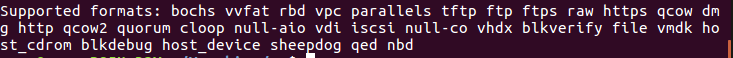

### 手动版

安装基本环境：

```
sudo apt-get install qemu-kvm qemu virt-manager virt-viewer libvirt-bin bridge-utils
```

#### 配置桥接模式

系统版本：ubuntu14.04或16.04

停止网络服务，编辑interface，编辑完后保存，开启网络服务。

```
sudo /etc/init.d/networking stop
sudo gedit /etc/network/interfaces
sudo /etc/init.d/networking start
```

如果想手动设置ip等请将以下代码复制到interfaces中，注意：IP等设置自己按照需要修改。

```
auto lo
iface lo inet loopback
auto eth0
iface eth0 inet manual
auto br0
iface br0 inet static
address 192.168.200.130
network 192.168.200.0
netmask 255.255.255.0
broadcast 192.168.200.255
gateway 192.168.200.1
dns-nameservers 8.8.8.8
bridge_ports eth0
bridge_stp off
bridge_fd 0
bridge_maxwait 0
```

如果想自动从DHCP获取，请将一下代码复制到编辑的文件中。注意修改网卡名，通过ifconfig查看网卡，将eth0修改为合适的网卡名称。

```
auto lo
iface lo inet loopback
auto eth0
iface eth0 inet manual
auto br0
iface br0 inet dhcp
bridge_ports eth0
bridge_stp off
bridge_fd 0
```

#### 配置虚拟机

这里主要基于已经制作好了的虚拟机镜像来启动虚拟机。

可通过下面的命令查看qemu支持的镜像格式：

```
qemu-img -h
```



最常用的格式主要是raw,qcow2,vdi,vmdk等。

下面介绍一下配置文件xml的格式（以虚拟机FreeDOS.qcow2的配置文件FreeDOS.xml为例）：

```
<?xml version="1.0" ?><domain type="kvm">
    <name>FreeDOS</name>     //虚拟机名称                
    <memory>1048576</memory>     //最大内存，单位为KB            
    <currentMemory>1048576</currentMemory>  //可用内存，单位为KB  
    <vcpu>1</vcpu>           //虚拟CPU个数                          
    <os>
      <type arch="x86_64" machine="pc">hvm</type> //type表示全虚拟化合适半虚拟化，hvm表示全虚拟化。
      <boot dev="hd"/>    //boot指定启动方式。hd,即harddisk，从磁盘启动;cdrom,光盘启动
   </os>
   <features>
     <acpi/>
     <apic/>
     <pae/>
   </features>
   <clock offset="localtime"/>
   <on_poweroff>destroy</on_poweroff>  
   <on_reboot>restart</on_reboot>   
   <on_crash>destroy</on_crash>
   <devices>
     <emulator>/usr/bin/kvm-spice</emulator>  //emulator模拟器，给出二进制模拟器设备的完整路径。倘若不知道这个路径，可以通过virt-manager新建一个虚拟机，查看/etc/libvirt/qemu/中该虚拟机xml文件中的值。
     <disk device="disk" type="file">
      <driver name="qemu" type="qcow2"/>  //指定驱动名和类型，由于该镜像是qcow2的格式，故type=“qcow2”，若为vdi格式，则相应的type=“vdi"。
       <source file="/home/nana/Vmachine/FreeDOS/FreeDOS.qcow2"/> 
   //目的镜像位置.
       <target bus="ide" dev="hda"/>
     </disk>
    <interface type="bridge">   //设置虚拟机网络连接方式为bridge  
      <source bridge="br0"/>     //网桥名
      <mac address="00:00:00:00:00:01"/>  //发配mac地址，需唯一
    </interface>
    <input bus="ps2" type="mouse"/>
     <graphics autoport="yes" keymap="en-us" listen="0.0.0.0" port="-1" type="vnc"/>
   </devices>
 </domain>
```

通过virsh即可创建，运行该虚拟机：

```
virsh define FreeDOS.xml
virsh start FreeDOS
```

### 自动版

将vmachine_set.py与虚拟机以及xml文件放在一个文件夹下，root权限运行vmachine_set.py即可。该程序中有安装相应包的函数，以防运行时容易出错，建议先在命令行安装相应的安装包。

```
sudo apt-get install qemu-kvm qemu virt-manager virt-viewer libvirt-bin bridge-utils
```
主要包含3个函数，功能分别为安装环境，设置桥接，以及定义并运行虚拟机。

set_bridge()函数里，需要用户查看网卡名后输入一个网卡的名字，来设置桥接。该程序里设置的网桥名称为“br0”，虚拟机xml文件中有一项需设置该网桥名。若系统之前已配置好网桥模式，则注意查看网桥名，并修改虚拟机xml文件中的相应内容。

define_xml()函数用来遍历当前文件夹中后缀为'qcow2','raw','vdi','vmdk'的虚拟机，并查找每个虚拟机对应的xml文件，由于xml文件中有一项需要填入目的镜像的路径，在函数中会对该路径进行修改。修改完成后，就会调用llibvirt，define虚拟机，create虚拟机。

```python
def install_env():
	 return os.system("sudo apt-get install qemu-kvm qemu virt-manager virt-viewer libvirt-bin bridge-utils")
		
def set_bridge():
	file = '/etc/network/interfaces'   //网络配置文件
	try:
		with open(file) as f:
			strs = f.read()
		f.close()
	except:
		return False
	if 'bridge_ports' in strs:
		print "bridge has exist!"
		return True
	else:
		nic = raw_input("请输入作为桥接的网卡名:")
		os.system("sudo /etc/init.d/networking stop")
		f = open(file,'w+')
		add_strs = "auto "+nic+"\niface "+nic+" inet manual\nauto br0\niface br0 inet dhcp\nbridge_ports "+nic+"\nbridge_stp off\nbridge_fd 0"
		f.write(strs+add_strs)
		f.close()
		os.system("sudo /etc/init.d/networking start")
		print "bridge set successful!"
		return True

def define_xml():
	conn = libvirt.open('qemu:///system')
	path = os.getcwd()
	types = ['qcow2','raw','vdi','vmdk']
	for rt,dirs,files in os.walk(os.getcwd()):
		for file in files:
			if file.split('.')[1] in types:
				xml = os.path.join(rt,file.split('.')[0])+'.xml'
				filepath = os.path.join(rt,file)
				try:
					with open(xml) as f:
						strs = f.read()
				except:
					return False
				xmlDom = minidom.parseString(strs)
				domainNode = xmlDom.getElementsByTagName("devices")[0]
				domainNode.getElementsByTagName("source")[0].attributes['file'].value = filepath
				newStrs = xmlDom.toxml()
				f = open(xml, "w")
				f.write(newStrs)
				f.close()
				myDom = conn.defineXML(newStrs)
				myDom.create()
	return True
```

